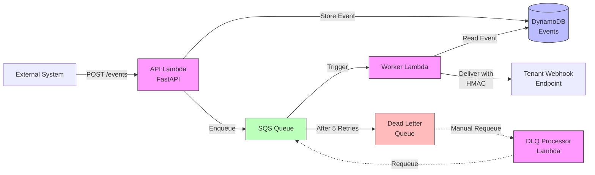
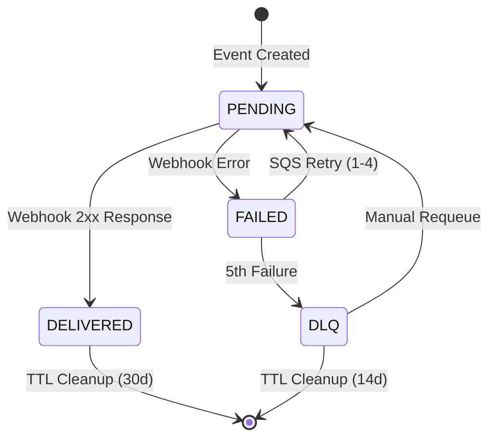
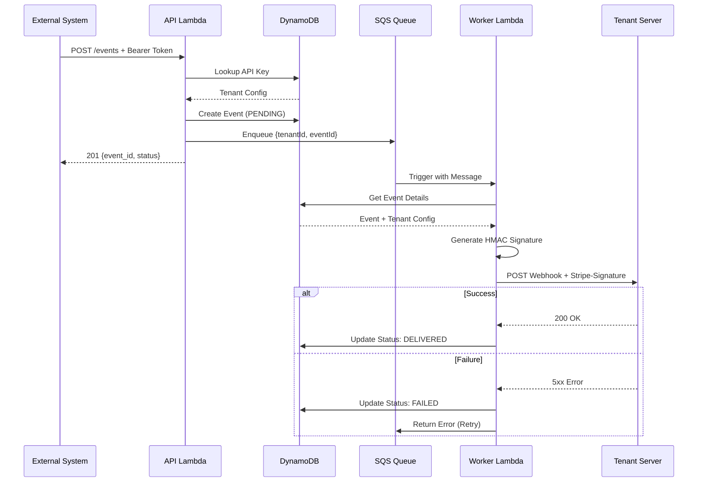

# Webhook Delivery System

Production-ready serverless webhook delivery platform built on AWS. Transform event ingestion into reliable push-based webhook delivery with automatic retries, HMAC signatures, and comprehensive observability.

## Overview

This system provides a complete webhook delivery infrastructure that:
- Ingests events via REST API
- Queues events for reliable async processing
- Delivers webhooks to tenant-configured endpoints
- Validates deliveries with Stripe-style HMAC signatures
- Automatically retries failed deliveries with exponential backoff
- Routes permanently failed messages to a Dead Letter Queue

## Architecture

**Components:**
- **API Lambda** (FastAPI): Event ingestion with Bearer token auth
- **SQS Queue**: Reliable message queue with 5 retry attempts
- **Worker Lambda**: Webhook delivery with HMAC signature generation
- **DLQ Processor Lambda**: Manual requeue for failed deliveries
- **DynamoDB**: Event and tenant data with TTL support
- **Custom Domain**: hooks.vincentchan.cloud with ACM SSL

**System Diagram:**



**Event Lifecycle:**



**Delivery Sequence:**



## Features

- ✅ **Reliable Delivery**: SQS-backed processing with automatic retries
- ✅ **Security**: Stripe-style HMAC-SHA256 webhook signatures
- ✅ **Retry Logic**: Exponential backoff (1min, 2min, 4min, 8min, 16min)
- ✅ **Multi-tenant**: Isolated API keys and webhook endpoints per tenant
- ✅ **Custom Domain**: Professional SSL-enabled domain
- ✅ **Auto-cleanup**: 30-day TTL on delivered events
- ✅ **DLQ Management**: Manual requeue of failed messages
- ✅ **No Lambda Layers**: Dependencies bundled directly for simplicity

## Quick Start

### Prerequisites

- AWS CLI configured with credentials
- Python 3.12+
- Node.js 18+ (for CDK)
- Environment variables in `.env`:
  ```bash
  HOSTED_ZONE_ID=Z00669322LNYAWLYNIHGN
  HOSTED_ZONE_URL=vincentchan.cloud
  ```

### Deploy

```bash
# Deploy infrastructure and seed test data
./scripts/deploy.sh
```

This will:
1. Install CDK dependencies
2. Bootstrap CDK (if needed)
3. Deploy all AWS resources (DynamoDB, Lambda, SQS, API Gateway, Custom Domain)
4. Seed 3 test tenants with API keys

### Send Your First Event

```bash
# Get API key from deploy output, then:
curl -X POST https://hooks.vincentchan.cloud/events \
  -H "Authorization: Bearer <api-key-from-deploy>" \
  -H "Content-Type: application/json" \
  -d '{"event": "user.signup", "user_id": "123", "email": "test@example.com"}'

# Response:
# {"event_id": "evt_abc123", "status": "PENDING"}
```

### Receive Webhooks

See [Webhook Integration Guide](docs/WEBHOOK_INTEGRATION.md) for complete receiver implementation with signature verification.

## Monitoring

```bash
# Check event status
aws dynamodb get-item \
  --table-name Vincent-TriggerApi-Events \
  --key '{"tenantId": {"S": "acme"}, "eventId": {"S": "evt_123"}}'

# View DLQ messages
aws sqs receive-message \
  --queue-url <dlq-url> \
  --max-number-of-messages 10
```

## Project Structure

```
zapier/
├── cdk/
│   ├── app.py                          # CDK application entry
│   ├── stacks/
│   │   └── webhook_delivery_stack.py  # Infrastructure definition
│   └── requirements.txt
├── src/
│   ├── api/                            # Event Ingestion Lambda
│   │   ├── main.py                     # FastAPI app + Mangum handler
│   │   ├── auth.py                     # Bearer token authentication
│   │   ├── routes.py                   # POST /events endpoint
│   │   ├── dynamo.py                   # DynamoDB operations
│   │   ├── models.py                   # Pydantic request/response models
│   │   └── requirements.txt            # FastAPI, Mangum, boto3, pydantic
│   ├── worker/                         # Webhook Delivery Lambda
│   │   ├── handler.py                  # SQS event processor
│   │   ├── delivery.py                 # HTTP webhook delivery
│   │   ├── signatures.py               # HMAC signature generation
│   │   ├── dynamo.py                   # Event status updates
│   │   └── requirements.txt            # boto3, requests
│   └── dlq_processor/                  # DLQ Requeue Lambda
│       ├── handler.py                  # Manual DLQ requeue
│       └── requirements.txt
├── scripts/
│   ├── deploy.sh                       # Automated deployment
│   └── seed_webhooks.py                # Test tenant seeding
├── tests/
│   ├── webhook_receiver.py             # FastAPI test receiver
│   └── requirements.txt
├── docs/
│   └── WEBHOOK_INTEGRATION.md          # Integration guide
└── README.md
```

## Configuration

### Tenant Setup

Each tenant needs:
- **API Key**: For authentication when posting events
- **Webhook Secret**: For HMAC signature generation
- **Target URL**: Where webhooks will be delivered

Add via DynamoDB or seeding script:

```python
# scripts/seed_webhooks.py creates test tenants
python scripts/seed_webhooks.py
```

### Event Schema

Events are stored with:
```python
{
    "tenantId": "acme",
    "eventId": "evt_abc123",
    "status": "PENDING" | "DELIVERED" | "FAILED",
    "createdAt": "1700000000",
    "payload": {...},           # Your event data
    "targetUrl": "https://...",
    "webhookSecret": "whsec_...",
    "attempts": 0,
    "lastAttemptAt": "1700000000",
    "ttl": 1702592000          # Auto-delete after 30 days
}
```

## Testing

### Local Webhook Receiver

Test webhook delivery with the included FastAPI receiver:

```bash
# Terminal 1: Start receiver
pip install -r tests/requirements.txt
python tests/webhook_receiver.py

# Terminal 2: Expose via ngrok
ngrok http 5000

# Terminal 3: Update tenant and send test event
aws dynamodb update-item \
  --table-name Vincent-TriggerApi-TenantApiKeys \
  --key '{"apiKey": {"S": "YOUR_API_KEY"}}' \
  --update-expression "SET targetUrl = :url" \
  --expression-attribute-values '{":url": {"S": "https://YOUR_NGROK_URL/webhook"}}'

curl -X POST https://hooks.vincentchan.cloud/events \
  -H "Authorization: Bearer YOUR_API_KEY" \
  -H "Content-Type: application/json" \
  -d '{"test": "event"}'
```

### Verify Signature

The test receiver validates HMAC signatures. Check the logs for:
```
✓ Valid webhook received: {"test": "event"}
```

## Monitoring & Operations

### Check Event Status

```bash
# Get specific event
aws dynamodb get-item \
  --table-name Vincent-TriggerApi-Events \
  --key '{"tenantId": {"S": "acme"}, "eventId": {"S": "evt_123"}}'

# Query by status
aws dynamodb query \
  --table-name Vincent-TriggerApi-Events \
  --index-name status-index \
  --key-condition-expression "#status = :status" \
  --expression-attribute-names '{"#status": "status"}' \
  --expression-attribute-values '{":status": {"S": "FAILED"}}'
```

### CloudWatch Logs

Monitor delivery in real-time:
```bash
# Worker Lambda logs
aws logs tail /aws/lambda/Vincent-TriggerApi-WorkerHandler --follow

# API Lambda logs
aws logs tail /aws/lambda/Vincent-TriggerApi-ApiHandler --follow
```

### DLQ Management

Requeue failed messages after fixing issues:

```bash
aws lambda invoke \
  --function-name Vincent-TriggerApi-DlqProcessor \
  --payload '{"batchSize": 10, "maxMessages": 100}' \
  response.json

cat response.json
# {"statusCode": 200, "body": "{\"requeued\": 5, \"failed\": 0}"}
```

### View DLQ Messages

```bash
aws sqs receive-message \
  --queue-url $(aws cloudformation describe-stacks \
    --stack-name WebhookDeliveryStack \
    --query 'Stacks[0].Outputs[?OutputKey==`EventsDlqUrl`].OutputValue' \
    --output text) \
  --max-number-of-messages 10
```

## Troubleshooting

### Event Not Delivered

1. **Check event status**: Should be PENDING → DELIVERED
2. **Check CloudWatch Logs**: Look for delivery errors
3. **Verify target URL**: Must be accessible from Lambda
4. **Check webhook secret**: Must match between tenant config and receiver

### Signature Validation Failing

1. **Time sync**: Signature includes timestamp, check clock skew
2. **Payload format**: Must be exact JSON string used in HMAC
3. **Secret mismatch**: Webhook secret must match exactly

### Messages in DLQ

1. **Review error logs**: Check why deliveries failed
2. **Fix root cause**: Update target URL, fix receiver, etc.
3. **Requeue**: Use DLQ Processor Lambda to retry

## Cleanup

```bash
# Destroy all AWS resources
cd cdk
cdk destroy

# Confirm destruction
# WARNING: This deletes all data including events and API keys
```

## Development

### Local Development

```bash
# Install dependencies
pip install -r cdk/requirements.txt

# Run CDK synth to validate
cd cdk && cdk synth

# Test Lambda locally (requires Docker)
sam local invoke ApiLambda -e test_event.json
```

### Code Style

All Python code formatted with Black:
```bash
black .
```

## Documentation

- [Webhook Integration Guide](docs/WEBHOOK_INTEGRATION.md) - Receiver implementation
- [Implementation Plan](thoughts/shared/plans/2025-11-21-webhook-delivery-system-rewrite.md) - Architecture decisions

## License

MIT
