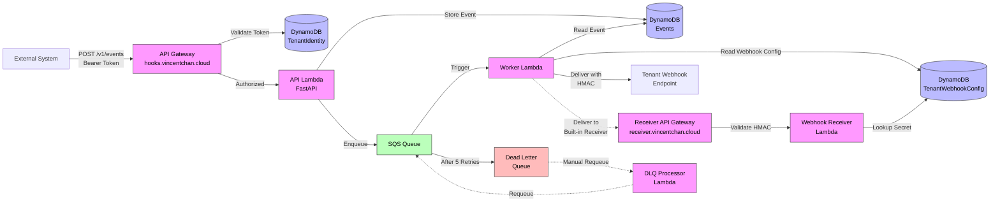
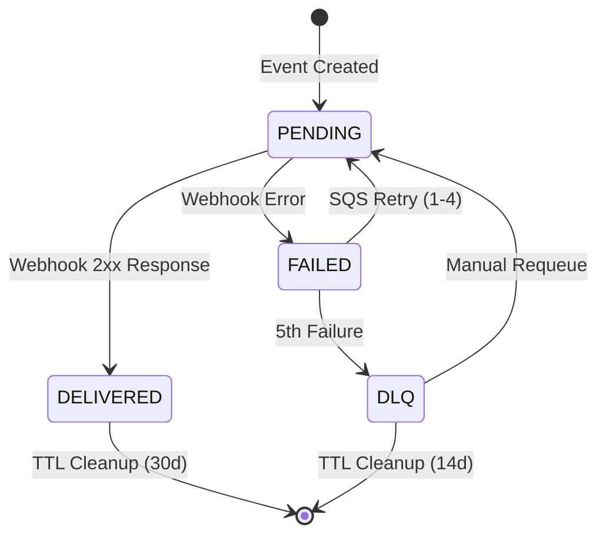
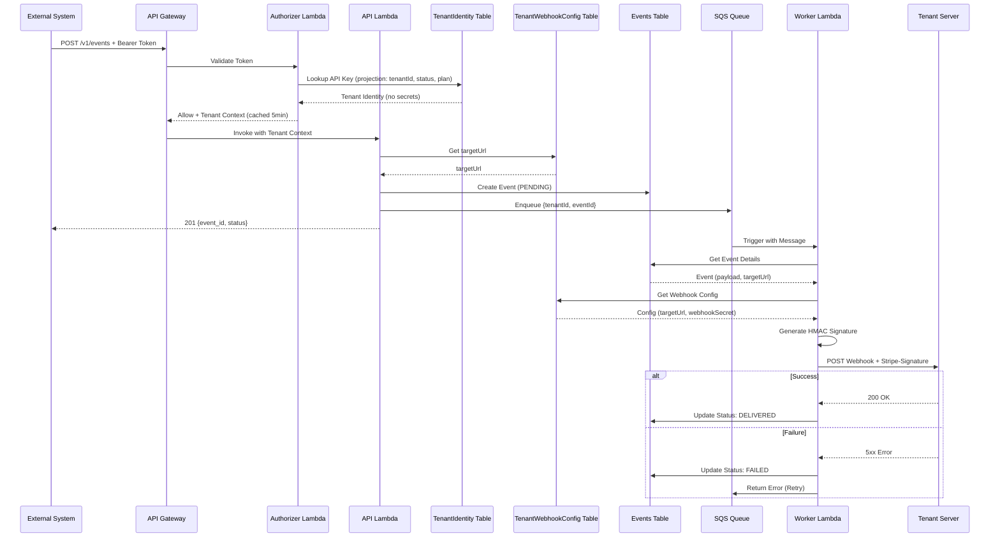

# Webhook Delivery System

## OpenAPI Docs

- https://hooks.vincentchan.cloud/v1/docs#/
- https://receiver.vincentchan.cloud/docs#/

## Overview

This system provides a complete webhook delivery infrastructure that:

- Ingests events via REST API
- Queues events for reliable async processing
- Delivers webhooks to tenant-configured endpoints
- Validates deliveries with Stripe-style HMAC signatures
- Automatically retries failed deliveries with exponential backoff
- Routes permanently failed messages to a Dead Letter Queue

## Architecture

**Components:**

- **Lambda Authorizer**: API Gateway authorizer for Bearer token validation (5-min cache)
- **API Lambda** (FastAPI): Event ingestion with tenant context from authorizer
- **SQS Queue**: Reliable message queue with 5 retry attempts (180s visibility timeout > 60s Lambda timeout)
- **Worker Lambda**: Webhook delivery with HMAC signature generation
- **Webhook Receiver Lambda** (FastAPI): Multi-tenant webhook validation with HMAC verification
- **DLQ Processor Lambda**: Manual requeue for failed deliveries
- **DynamoDB**: Three tables with strict separation of concerns:
  - **TenantIdentity**: API keys → tenant identity (authentication only)
  - **TenantWebhookConfig**: tenantId → webhook delivery config (targetUrl, webhookSecret)
  - **Events**: Event storage with TTL support
- **Custom Domains**:
  - hooks.vincentchan.cloud (Main API - REGIONAL endpoint with ACM SSL)
  - receiver.vincentchan.cloud (Webhook Receiver - REGIONAL endpoint with ACM SSL)

**System Diagram:**



**Event Lifecycle:**



**Delivery Sequence:**



## Features

- ✅ **Reliable Delivery**: SQS-backed processing with automatic retries
- ✅ **Security**: Stripe-style HMAC-SHA256 webhook signatures
- ✅ **API Gateway Authorizer**: Lambda authorizer with 5-minute caching for performance
- ✅ **Interactive API Docs**: Public Swagger UI and ReDoc documentation
- ✅ **Retry Logic**: Exponential backoff (1min, 2min, 4min, 8min, 16min)
- ✅ **Multi-tenant**: Isolated API keys and webhook endpoints per tenant
- ✅ **Auto-cleanup**: 30-day TTL on delivered events
- ✅ **DLQ Management**: Manual requeue of failed messages

## API Documentation

Interactive API documentation is available at:

- **Swagger UI**: https://hooks.vincentchan.cloud/v1/docs
- **ReDoc**: https://hooks.vincentchan.cloud/v1/redoc
- **OpenAPI Schema**: https://hooks.vincentchan.cloud/v1/openapi.json

These endpoints are publicly accessible (no authentication required) for easy integration.

## Quick Start

### Prerequisites

- AWS CLI configured with credentials
- Python 3.12+
- Node.js 20+ (for CDK)
- Environment variables in `.env`:
  ```bash
  PREFIX=Vincent-Events
  HOSTED_ZONE_ID=Z00669322LNYAWLYNIHGN
  HOSTED_ZONE_URL=vincentchan.cloud
  ```

### Deploy

Go into `cdk/` and run

```bash
cdk deploy
```

## Project Structure

```
/
├── cdk/
│   ├── app.py                          # CDK application entry
│   ├── stacks/
│   │   └── webhook_delivery_stack.py  # Infrastructure definition
│   └── requirements.txt
├── src/
│   ├── authorizer/                     # API Gateway Authorizer Lambda
│   │   ├── handler.py                  # Bearer token validation
│   │   └── requirements.txt            # boto3
│   ├── api/                            # Event Ingestion Lambda
│   │   ├── main.py                     # FastAPI app + Mangum handler
│   │   ├── context.py                  # Extract tenant from authorizer context
│   │   ├── routes.py                   # POST /v1/events endpoint
│   │   ├── dynamo.py                   # DynamoDB operations
│   │   ├── models.py                   # Pydantic request/response models
│   │   └── requirements.txt            # FastAPI, Mangum, boto3, pydantic
│   ├── worker/                         # Webhook Delivery Lambda
│   │   ├── handler.py                  # SQS event processor
│   │   ├── delivery.py                 # HTTP webhook delivery (with DecimalEncoder)
│   │   ├── signatures.py               # HMAC signature generation
│   │   ├── dynamo.py                   # Event status updates
│   │   └── requirements.txt            # boto3, requests
│   ├── webhook_receiver/               # Webhook Receiver Lambda
│   │   ├── main.py                     # FastAPI app + Mangum handler
│   │   └── requirements.txt            # fastapi, mangum, boto3
│   └── dlq_processor/                  # DLQ Requeue Lambda
│       ├── handler.py                  # Manual DLQ requeue
│       └── requirements.txt
└── README.md
```
